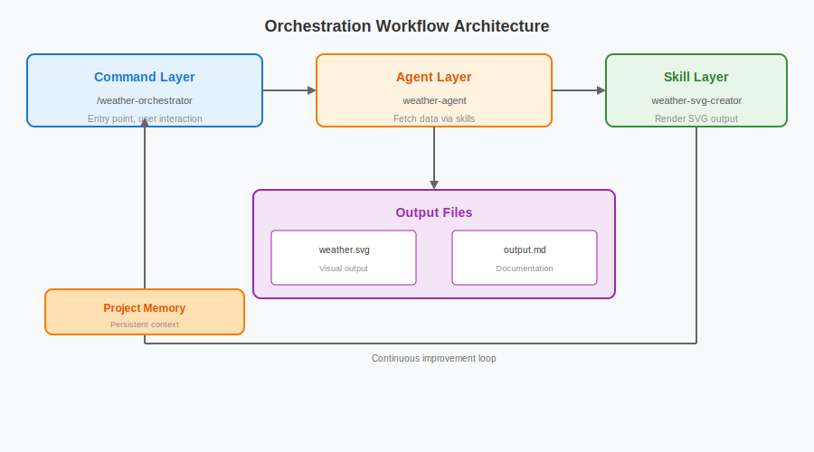

# claude-code-best-practice
practice makes claude perfect

[](best-practice/) [](implementation/) [](orchestration-workflow/orchestration-workflow.md)<br>
 = Agents ·  = Commands ·  = Skills

<p align="center">
  
</p>

## 🧠 概念

| 功能 | 位置 | 描述 |
|------|------|------|
|  [**Subagents**](https://code.claude.com/docs/en/sub-agents) | `.claude/agents/<name>.md` | [](best-practice/claude-subagents.md) [](implementation/claude-subagents-implementation.md) 新鲜隔离上下文中的自主执行者 — 自定义工具、权限、模型、记忆和持久身份 |
|  [**Commands**](https://code.claude.com/docs/en/slash-commands) | `.claude/commands/<name>.md` | [](best-practice/claude-commands.md) [](implementation/claude-commands-implementation.md) 注入现有上下文的知识 — 简单用户调用提示模板，用于工作流编排 |
|  [**Skills**](https://code.claude.com/docs/en/skills) | `.claude/skills/<name>/SKILL.md` | [](best-practice/claude-skills.md) [](implementation/claude-skills-implementation.md) 注入现有上下文的知识 — 可配置、可预加载、可自动发现，支持上下文分叉和渐进式披露 · [官方 Skills](https://github.com/anthropics/skills/tree/main/skills) |
| [**工作流**](https://code.claude.com/docs/en/common-workflows) | [`.claude/commands/weather-orchestrator.md`](.claude/commands/weather-orchestrator.md) | [](orchestration-workflow/orchestration-workflow.md) |
| [**Hooks**](https://code.claude.com/docs/en/hooks) | `.claude/hooks/` | [](https://github.com/shanraisshan/claude-code-hooks) [](https://github.com/shanraisshan/claude-code-hooks) 在特定事件上运行于 agentic 循环之外的用户定义处理器（脚本、HTTP、提示、agents） |
| [**MCP 服务器**](https://code.claude.com/docs/en/mcp) | `.claude/settings.json`, `.mcp.json` | [](best-practice/claude-mcp.md) [](.mcp.json) Model Context Protocol 连接到外部工具、数据库和 API |
| [**插件**](https://code.claude.com/docs/en/plugins) | distributable packages | skills、subagents、hooks、MCP 服务器和 LSP 服务器的捆绑包 · [市场](https://code.claude.com/docs/en/discover-plugins) |
| [**设置**](https://code.claude.com/docs/en/settings) | `.claude/settings.json` | [](best-practice/claude-settings.md) [](.claude/settings.json) 分层配置系统 · [权限](https://code.claude.com/docs/en/permissions) · [模型配置](https://code.claude.com/docs/en/model-config) · [输出样式](https://code.claude.com/docs/en/output-styles) · [沙盒](https://code.claude.com/docs/en/sandboxing) · [键绑定](https://code.claude.com/docs/en/keybindings) · [快速模式](https://code.claude.com/docs/en/fast-mode) |
| [**状态行**](https://code.claude.com/docs/en/statusline) | `.claude/settings.json` | [](https://github.com/shanraisshan/claude-code-status-line) [](.claude/settings.json) 可自定义状态栏，显示上下文使用情况、模型、成本和会话信息 |
| [**记忆**](https://code.claude.com/docs/en/memory) | `CLAUDE.md`, `.claude/rules/`, `~/.claude/rules/`, `~/.claude/projects/<project>/memory/` | [](best-practice/claude-memory.md) [](CLAUDE.md) 通过 CLAUDE.md 文件和 `@path` 导入实现持久上下文 |
| [**检查点**](https://code.claude.com/docs/en/checkpointing) | automatic (git-based) | 自动跟踪文件编辑，支持回滚 (`Esc Esc` 或 `/rewind`) 和针对性摘要 |
| [**CLI 启动参数**](https://code.claude.com/docs/en/cli-reference) | `claude [flags]` | [](best-practice/claude-cli-startup-flags.md) 用于启动 Claude Code 的命令行参数、子命令和环境变量 |
| **AI 术语** | | [](https://github.com/shanraisshan/claude-code-codex-cursor-gemini/blob/main/reports/ai-terms.md) Agentic Engineering · Context Engineering · Vibe Coding |
| [**最佳实践**](https://code.claude.com/docs/en/best-practices) | | 官方最佳实践 · [提示工程](https://github.com/anthropics/prompt-eng-interactive-tutorial) |

### 🔥 热门

| 功能 | 位置 | 描述 |
|------|------|------|
| [**自动模式**](https://code.claude.com/docs/en/permission-modes#eliminate-prompts-with-auto-mode)  | `--permission-mode auto` | 后台安全分类器替代手动权限提示 — Claude 自行判断安全性，同时阻止提示注入和风险升级 |
| [**频道**](https://code.claude.com/docs/en/channels)  | `--channels`, 基于插件 | 将 Telegram、Discord 或 webhook 事件推送到运行中的会话 — Claude 在你离开时做出反应 |
| [**Slack**](https://code.claude.com/docs/en/slack) | Slack 中的 `@Claude` | 在团队聊天中提及 @Claude 并分配编码任务 — 路由到 Claude Code web 会话进行 bug 修复、代码审查和并行任务执行 |
| [**代码审查**](https://code.claude.com/docs/en/code-review)  | GitHub App (托管) | 多 agent PR 分析，检测 bug、安全漏洞和回归问题 |
| [**GitHub Actions**](https://code.claude.com/docs/en/github-actions) | `.github/workflows/` | 在 CI/CD 管道中自动化 PR 审查、问题分类和代码生成 |
| [**Chrome**](https://code.claude.com/docs/en/chrome)  | `--chrome`, 扩展 | [](reports/claude-in-chrome-v-chrome-devtools-mcp.md) 通过 Claude in Chrome 实现浏览器自动化 — 测试 web 应用、使用控制台调试、自动化表单、从页面提取数据 |
| [**定时任务**](https://code.claude.com/docs/en/scheduled-tasks) | `/loop`, `/schedule`, cron 工具 | [](implementation/claude-scheduled-tasks-implementation.md) `/loop` 在本地定期运行提示（最长 3 天）· `/schedule` 在云端 Anthropic 基础设施上运行提示 — 即使你的机器关闭也能工作 |
| [**语音输入**](https://code.claude.com/docs/en/voice-dictation)  | `/voice` | 提示的按压通话语音输入，支持 20 种语言和可重新绑定的激活键 |
| [**简化与批处理**](https://code.claude.com/docs/en/skills#bundled-skills) | `/simplify`, `/batch` | 用于代码质量和批量操作的内置技能 — 简化重构以提高复用性和效率，批处理跨文件运行命令 |
| [**Agent Teams**](https://code.claude.com/docs/en/agent-teams)  | 内置 (环境变量) | [](implementation/claude-agent-teams-implementation.md) 多个 agent 在同一代码库上并行工作，共享任务协调 |
| [**远程控制**](https://code.claude.com/docs/en/remote-control) | `/remote-control`, `/rc` | 从任何设备继续本地会话 — 手机、平板或浏览器 |
| [**Git Worktrees**](https://code.claude.com/docs/en/common-workflows#run-parallel-claude-code-sessions-with-git-worktrees) | 内置 | 用于并行开发的隔离 git 分支 — 每个 agent 都有自己的工作副本 |
| [**Ralph Wiggum Loop**](https://github.com/anthropics/claude-code/tree/main/plugins/ralph-wiggum) | 插件 | 用于长时间运行自主任务的自主开发循环 — 迭代直到完成 |

<p align="center">
  
</p>

<a id="orchestration-workflow"></a>

## <a href="orchestration-workflow/orchestration-workflow.md"></a>

查看 [orchestration-workflow](orchestration-workflow/orchestration-workflow.md) 了解  **Command** →  **Agent** →  **Skill** 模式的实现细节。

<p align="center">
  
</p>


```bash
claude
/weather-orchestrator
```

<p align="center">
  
</p>

## ⚙️ 开发工作流

所有主要工作流都收敛到相同的架构模式：**研究 → 计划 → 执行 → 审查 → 发布**

| 名称 | ★ | 独特性 | 计划 |  |  |  |
|------|---|--------|------|---|---|---|
| [Superpowers](https://github.com/obra/superpowers) | 122k |    |  [writing-plans](https://github.com/obra/superpowers/tree/main/skills/writing-plans) | 5 | 3 | 14 |
| [Everything Claude Code](https://github.com/affaan-m/everything-claude-code) | 116k |    |  [planner](https://github.com/affaan-m/everything-claude-code/blob/main/agents/planner.md) | 30 | 63 | 135 |
| [Spec Kit](https://github.com/github/spec-kit) | 83k |    |  [speckit.plan](https://github.com/github/spec-kit/blob/main/templates/commands/plan.md) | 0 | 9+ | 0 |
| [gstack](https://github.com/garrytan/gstack) | 55k |    |  [autoplan](https://github.com/garrytan/gstack/tree/main/autoplan) | 0 | 0 | 28 |
| [Get Shit Done](https://github.com/gsd-build/get-shit-done) | 44k |    |  [gsd-planner](https://github.com/gsd-build/get-shit-done/blob/main/agents/gsd-planner.md) | 18 | 57 | 0 |
| [BMAD-METHOD](https://github.com/bmad-code-org/BMAD-METHOD) | 43k |    |  [bmad-create-prd](https://github.com/bmad-code-org/BMAD-METHOD/tree/main/src/bmm-skills/2-plan-workflows/bmad-create-prd) | 0 | 0 | 40 |
| [OpenSpec](https://github.com/Fission-AI/OpenSpec) | 35k |    |  [opsx:propose](https://github.com/Fission-AI/OpenSpec/blob/main/src/commands/workflow/new-change.ts) | 0 | 11 | 0 |
| [Compound Engineering](https://github.com/EveryInc/compound-engineering-plugin) | 12k |    |  [ce-plan](https://github.com/EveryInc/compound-engineering-plugin/tree/main/plugins/compound-engineering/skills/ce-plan) | 48 | 4 | 42 |
| [Humanlayer](https://github.com/humanlayer/humanlayer) | 10k |    |  [create_plan](https://github.com/humanlayer/humanlayer/blob/main/.claude/commands/create_plan.md) | 6 | 27 | 0 |

### 其他
- [跨模型 (Claude Code + Codex) 工作流](development-workflows/cross-model-workflow/cross-model-workflow.md) [](development-workflows/cross-model-workflow/cross-model-workflow.md)
- [RPI](development-workflows/rpi/rpi-workflow.md) [](development-workflows/rpi/rpi-workflow.md)
- [Ralph Wiggum Loop](https://www.youtube.com/watch?v=eAtvoGlpeRU) [](https://github.com/shanraisshan/novel-llm-26)

<p align="center">
  
</p>

## 💡 技巧和诀窍 (87)

🚫👶 = 不要过度照顾

[提示](#tips-prompting) · [计划](#tips-planning) · [CLAUDE.md](#tips-claudemd) · [Agents](#tips-agents) · [Commands](#tips-commands) · [Skills](#tips-skills) · [Hooks](#tips-hooks) · [工作流](#tips-workflows) · [高级工作流](#tips-workflows-advanced) · [Git / PR](#tips-git-pr) · [调试](#tips-debugging) · [工具](#tips-utilities)


<a id="tips-prompting"></a>■ **提示 (3)**

| 技巧 | 来源 |
|------|------|
| 挑战 Claude — "grill me on these changes and don't make a PR until I pass your test." 或 "prove to me this works" 并让 Claude diff main 和你的分支 🚫👶 | |
| 在平庸的修复之后 — "knowing everything you know now, scrap this and implement the elegant solution" 🚫👶 | |
| Claude 自己修复大多数 bug — 粘贴 bug，说 "fix"，不要微观管理如何 🚫👶 | |

<a id="tips-planning"></a>■ **计划/规范 (6)**

| 技巧 | 来源 |
|------|------|
| 始终从 [plan mode](https://code.claude.com/docs/en/common-workflows) 开始 | |
| 从最小规范或提示开始，让 Claude 使用 [AskUserQuestion](https://code.claude.com/docs/en/cli-reference) 工具采访你，然后创建新会话执行规范 | |
| 始终制定分阶段门控计划，每个阶段有多个测试（单元、自动化、集成） | |
| 启动第二个 Claude 作为 staff engineer 审查你的计划，或使用 [cross-model](development-workflows/cross-model-workflow/cross-model-workflow.md) 进行审查 | |
| 编写详细规范并减少歧义后再移交工作 — 越具体，输出越好 | |
| 原型 > PRD — 构建 20-30 个版本而不是编写规范，构建成本低，多尝试 | |

<a id="tips-claudemd"></a>■ **CLAUDE.md (7)**

| 技巧 | 来源 |
|------|------|
| [CLAUDE.md](https://code.claude.com/docs/en/memory) 应该每文件少于 [200 行](https://code.claude.com/docs/en/memory#write-effective-instructions) | |
| 将特定领域的 CLAUDE.md 规则包装在 [`<important if="...">` 标签](https://www.hlyr.dev/blog/stop-claude-from-ignoring-your-claude-md) 中，防止 Claude 忽略它们 | |
| 对于 monorepos 使用 [多个 CLAUDE.md](best-practice/claude-memory.md) — 祖先 + 后代加载 | |
| 使用 [.claude/rules/](https://code.claude.com/docs/en/memory#organize-rules-with-clauderules) 拆分大型指令 | |
| [memory.md](https://code.claude.com/docs/en/memory), constitution.md 不保证任何事情 | |
| 任何开发者都应该能够启动 Claude，说 "run the tests" 并在第一次尝试时就成功 — 如果不成功，你的 CLAUDE.md 缺少必要的设置/构建/测试命令 | |
| 保持代码库整洁并完成迁移 — 部分迁移的框架会混淆模型，可能会选择错误的模式 | |
| 使用 [settings.json](best-practice/claude-settings.md) 强制执行行为（归属、权限、模型）— 不要在 CLAUDE.md 中写 "NEVER add Co-Authored-By"，而 `attribution.commit: ""` 是确定性的 | |

<a id="tips-agents"></a> **Agents (4)**

| 技巧 | 来源 |
|------|------|
| 使用功能特定的 [sub-agents](https://code.claude.com/docs/en/sub-agents)（额外上下文）和 [skills](https://code.claude.com/docs/en/skills)（渐进式披露），而不是通用的 qa、backend engineer | |
| 说 "use subagents" 来投入更多计算资源解决问题 — 将任务卸载以保持主上下文干净整洁 🚫👶 | |
| [带有 tmux 的 agent teams](https://code.claude.com/docs/en/agent-teams) 和 [git worktrees](https://x.com/bcherny/status/2025007393290272904) 用于并行开发 | |
| 使用 [test time compute](https://code.claude.com/docs/en/sub-agents) — 独立的上下文窗口让结果更好；一个 agent 可能导致 bug，另一个（相同模型）可以发现它们 | |

<a id="tips-commands"></a> **Commands (3)**

| 技巧 | 来源 |
|------|------|
| 使用 [commands](https://code.claude.com/docs/en/slash-commands) 而不是 [sub-agents](https://code.claude.com/docs/en/sub-agents) 处理工作流 | |
| 为每天多次执行的每个 "inner loop" 工作流使用 [slash commands](https://code.claude.com/docs/en/slash-commands) — 节省重复提示，commands 放在 `.claude/commands/` 并检入 git | |
| 如果每天做某事超过一次，将其转化为 [skill](https://code.claude.com/docs/en/skills) 或 [command](https://code.claude.com/docs/en/slash-commands) — 构建 `/techdebt`、上下文转储或分析命令 | |

<a id="tips-skills"></a> **Skills (9)**

| 技巧 | 来源 |
|------|------|
| 使用 [context: fork](https://code.claude.com/docs/en/skills) 在隔离的 subagent 中运行技能 — 主上下文只看到最终结果，看不到中间工具调用。agent 字段允许你设置 subagent 类型 | |
| 在 monorepos 中使用 [skills in subfolders](reports/claude-skills-for-larger-mono-repos.md) | |
| skills 是文件夹，不是文件 — 使用 references/、scripts/、examples/ 子目录进行 [渐进式披露](https://code.claude.com/docs/en/skills) | |
| 在每个 skill 中构建 Gotchas 部分 — 最高价值内容，随时间添加 Claude 的失败点 | |
| skill 的 description 字段是触发器，不是摘要 — 为模型编写它（"我应该在什么时候触发？"） | |
| 不要在 skills 中陈述显而易见的事情 — 专注于让 Claude 脱离默认行为的内容 🚫👶 | |
| 不要在 skills 中限制 Claude — 给出目标和约束，而不是规定性的一步一步指令 🚫👶 | |
| 在 skills 中包含脚本和库，让 Claude 组合而不是重建样板代码 | |
| 在 SKILL.md 中嵌入 `` !`command` `` 将动态 shell 输出注入提示 — Claude 在调用时运行它，模型只看到结果 | |

<a id="tips-hooks"></a>■ **Hooks (5)**

| 技巧 | 来源 |
|------|------|
| 在 skills 中使用 [on-demand hooks](https://code.claude.com/docs/en/skills) — /careful 阻止破坏性命令，/freeze 阻止目录外的编辑 | |
| 使用 [measure skill usage](https://code.claude.com/docs/en/skills) PreToolUse hook 查找热门或未充分触发的 skills | |
| 使用 [PostToolUse hook](https://code.claude.com/docs/en/hooks) 自动格式化代码 — Claude 生成格式良好的代码，hook 处理最后 10% 以避免 CI 失败 | |
| 通过 hook 将 [permission requests](https://code.claude.com/docs/en/hooks) 路由到 Opus — 让它扫描攻击并自动批准安全的 🚫👶 | |
| 使用 [Stop hook](https://code.claude.com/docs/en/hooks) 在 turn 结束时提醒 Claude 继续或验证其工作 | |

<a id="tips-workflows"></a>■ **工作流 (7)**

| 技巧 | 来源 |
|------|------|
| 避免 agent 傻区，在最多 50% 时手动执行 [/compact](https://code.claude.com/docs/en/interactive-mode)。使用 [/clear](https://code.claude.com/docs/en/cli-reference) 在会话中间重置上下文（如果切换到新任务） | |
| 对于小任务，vanilla cc 比任何工作流都更好 | |
| 使用 [/model](https://code.claude.com/docs/en/model-config) 选择模型和推理，[/context](https://code.claude.com/docs/en/interactive-mode) 查看上下文使用情况，[/usage](https://code.claude.com/docs/en/costs) 检查计划限制，[/extra-usage](https://code.claude.com/docs/en/interactive-mode) 配置溢出计费，[/config](https://code.claude.com/docs/en/settings) 配置设置 — 使用 Opus 进行计划模式，使用 Sonnet 进行编码，两者兼顾 | |
| 始终在 [/config](https://code.claude.com/docs/en/settings) 中使用 [thinking mode](https://code.claude.com/docs/en/model-config) true（查看推理）和 [Output Style](https://code.claude.com/docs/en/output-styles) Explanatory（查看详细输出和 ★ Insight 框），以更好地理解 Claude 的决策 | |
| 在提示中使用 ultrathink 关键词进行 [高努力推理](https://docs.anthropic.com/en/docs/build-with-claude/extended-thinking#tips-and-best-practices) | |
| [/rename](https://code.claude.com/docs/en/cli-reference) 重要的会话（例如 [TODO - refactor task]）并稍后 [/resume](https://code.claude.com/docs/en/cli-reference) 它们 — 同时运行多个 Claudes 时为每个实例标记 | |
| 当 Claude 偏离轨道时，使用 [Esc Esc 或 /rewind](https://code.claude.com/docs/en/checkpointing) 撤销，而不是尝试在同一上下文中修复 | |

<a id="tips-workflows-advanced"></a>■ **高级工作流 (6)**

| 技巧 | 来源 |
|------|------|
| 大量使用 ASCII 图来理解你的架构 | |
| 使用 [/loop](https://code.claude.com/docs/en/scheduled-tasks) 进行本地定期监控（最长 3 天）· 使用 [/schedule](https://code.claude.com/docs/en/web-scheduled-tasks) 进行基于云的定期任务，即使你的机器关闭也能运行 | |
| 使用 [Ralph Wiggum plugin](https://github.com/shanraisshan/novel-llm-26) 处理长时间运行的自主任务 | |
| [/permissions](https://code.claude.com/docs/en/permissions) 使用通配符语法（Bash(npm run *), Edit(/docs/**)）而不是 dangerously-skip-permissions | |
| [/sandbox](https://code.claude.com/docs/en/sandboxing) 通过文件和网络隔离减少权限提示 — 内部减少 84% | |
| 投资 [产品验证](https://code.claude.com/docs/en/skills) skills（signup-flow-driver, checkout-verifier）— 值得花一周时间完善 | |

<a id="tips-git-pr"></a>■ **Git / PR (5)**

| 技巧 | 来源 |
|------|------|
| 保持 PR 小而专注 — [p50 为 118 行](tips/claude-boris-2-tips-25-mar-26.md)（141 个 PR，一天更改 45K 行），每个 PR 一个功能，易于审查和回滚 | |
| 始终 [squash merge](tips/claude-boris-2-tips-25-mar-26.md) PR — 干净的线性历史，每个功能一个提交，易于 git revert 和 git bisect | |
| 经常提交 — 至少每小时尝试提交一次，任务完成后立即提交 | |
| 在同事的 PR 上标记 [@claude](https://github.com/apps/claude) 自动生成重复审查反馈的 lint 规则 — 让自己从代码审查中自动化退出 🚫👶 | |
| 使用 [/code-review](https://code.claude.com/docs/en/code-review) 进行多 agent PR 分析 — 在合并前捕获 bug、安全漏洞和回归问题 | |

<a id="tips-debugging"></a>■ **调试 (7)**

| 技巧 | 来源 |
|------|------|
| 养成习惯，任何时候遇到问题都用 Claude 截图并分享 | |
| 使用 mcp（[Claude in Chrome](https://code.claude.com/docs/en/chrome)、[Playwright](https://github.com/microsoft/playwright-mcp)、[Chrome DevTools](https://developer.chrome.com/blog/chrome-devtools-mcp)）让 claude 自己查看 chrome 控制台日志 | |
| 始终要求 claude 将你想要查看日志的终端作为后台任务运行，以便更好地调试 | |
| [/doctor](https://code.claude.com/docs/en/cli-reference) 诊断安装、身份验证和配置问题 | |
| 压缩期间的错误可以通过使用 [/model](https://code.claude.com/docs/en/model-config) 选择 1M token 模型，然后运行 [/compact](https://code.claude.com/docs/en/interactive-mode) 来解决 | |
| 使用 [cross-model](development-workflows/cross-model-workflow/cross-model-workflow.md) 进行 QA — 例如 [Codex](https://github.com/shanraisshan/codex-cli-best-practice) 进行计划和实施审查 | |
| agent 搜索（glob + grep）胜过 RAG — Claude Code 尝试并丢弃向量数据库，因为代码会过时且权限复杂 | |

<a id="tips-utilities"></a>■ **工具 (5)**

| 技巧 | 来源 |
|------|------|
| 使用 [iTerm](https://iterm2.com/)/[Ghostty](https://ghostty.org/)/[tmux](https://github.com/tmux/tmux) 终端而不是 IDE（[VS Code](https://code.visualstudio.com/)/[Cursor](https://www.cursor.com/)） | |
| [Wispr Flow](https://wisprflow.ai) 用于语音提示（10 倍生产力） | |
| [claude-code-hooks](https://github.com/shanraisshan/claude-code-hooks) 用于 claude 反馈 | |
| [status line](https://github.com/shanraisshan/claude-code-status-line) 用于上下文意识和快速压缩 | |
| 探索 [settings.json](best-practice/claude-settings.md) 功能，如 [Plans Directory](best-practice/claude-settings.md#plans-directory)、[Spinner Verbs](best-practice/claude-settings.md#display--ux) 以获得个性化体验 | |

### 每日

| 技巧 | 来源 |
|------|------|
| [更新](https://code.claude.com/docs/en/setup) Claude Code 并开始新的一天阅读 [changelog](https://github.com/anthropics/claude-code/blob/main/CHANGELOG.md) | |

<p align="center">
  
</p>

## ☠️ 初创公司/业务

| Claude | 替代 |
|--------|------|
| [**代码审查**](https://code.claude.com/docs/en/code-review) | [Greptile](https://greptile.com), [CodeRabbit](https://coderabbit.ai), [Devin Review](https://devin.ai), [OpenDiff](https://opendiff.com), [Cursor BugBot](https://bugbot.dev) |
| [**语音输入**](https://code.claude.com/docs/en/voice-dictation) | [Wispr Flow](https://wisprflow.ai), [SuperWhisper](https://superwhisper.com/) |
| [**远程控制**](https://code.claude.com/docs/en/remote-control) | [OpenClaw](https://openclaw.ai/) |
| [**Cowork**](https://claude.com/blog/cowork-research-preview) | [OpenAI Operator](https://openai.com/operator), [AgentShadow](https://agentshadow.ai) |
| [**任务**](https://x.com/trq212/status/2014480496013803643) | [Beads](https://github.com/steveyegge/beads) |
| [**计划模式**](https://code.claude.com/docs/en/common-workflows) | [Agent OS](https://github.com/buildermethods/agent-os) |
| [**Skills / Plugins**](https://code.claude.com/docs/en/plugins) | YC AI wrapper startups ([reddit](https://reddit.com/r/ClaudeAI/comments/1r6bh4d/claude_code_skills_are_basically_yc_ai_startup/)) |

<p align="center">
  
</p>

<a id="billion-dollar-questions"></a>


*如果你有答案，请告诉我 shanraisshan@gmail.com*

**记忆和指令 (4)**

1. 你应该在 CLAUDE.md 中放什么 — 应该省略什么？
2. 如果已经有 CLAUDE.md，是否需要单独的 constitution.md 或 rules.md？
3. 应该多久更新一次 CLAUDE.md，如何知道它是否已经过时？
4. 为什么 Claude 仍然忽略 CLAUDE.md 指令 — 即使它们用全大写字母说 MUST？

**Agents、Skills 和工作流 (6)**

1. 何时应该使用 command vs agent vs skill — 何时 vanilla Claude Code 更好？
2. 随着模型改进，应该多久更新一次 agents、commands 和工作流？
3. 给 subagent 详细的角色设定是否能提高质量？"完美角色/提示"对于研究/QA subagent 是什么样的？
4. 应该依赖 Claude Code 的内置计划模式 — 还是构建自己的计划 command/agent 来强制执行团队的工作流？
5. 如果有个人技能（例如，使用你的编码风格的 /implement），如何整合社区技能（例如，/simplify）而不产生冲突 — 当它们分歧时谁获胜？
6. 我们到了吗？能否将现有代码库转换为规范，删除代码，然后让 AI 仅从这些规范重新生成完全相同的代码？

**规范和文档 (3)**

1. 仓库中的每个功能都应该有一个规范作为 markdown 文件吗？
2. 当实现新功能时，需要多久更新一次规范以防止它们过时？
3. 实现新功能时，如何处理对其他功能规范的连锁反应？

<p align="center">
  
</p>

## 报告

<p align="center">
  <a href="reports/claude-agent-sdk-vs-cli-system-prompts.md"></a>
  <a href="reports/claude-in-chrome-v-chrome-devtools-mcp.md"></a>
  <a href="reports/claude-global-vs-project-settings.md"></a>
  <a href="reports/claude-skills-for-larger-mono-repos.md"></a>
  <br>
  <a href="reports/claude-agent-memory.md"></a>
  <a href="reports/claude-advanced-tool-use.md"></a>
  <a href="reports/claude-usage-and-rate-limits.md"></a>
  <a href="reports/claude-agent-command-skill.md"></a>
  <br>
  <a href="reports/llm-day-to-day-degradation.md"></a>
</p>

<p align="center">
  
</p>


```
1. 像课程一样阅读仓库，在尝试使用之前了解 commands、agents、skills 和 hooks 是什么。
2. 克隆这个仓库并尝试示例，尝试 /weather-orchestrator，听 hook 声音，运行 agent teams，这样你就可以看到事情是如何工作的。
3. 去你自己的项目，让 Claude 建议你应该添加这个仓库中的哪些最佳实践，把这个仓库作为参考给它，这样它就知道什么是可能的。
```

<p align="center">
  
</p>

## 开发工作流

> | 工作流 | 描述 |
> |--------|------|
> | /workflows:development-workflows | 通过并行研究所有 8 个工作流仓库来更新开发工作流表和跨工作流分析报告 |
> | /workflows:best-practice:workflow-concepts | 使用最新的 Claude Code 功能和概念更新 README CONCEPTS 部分 |
> | /workflows:best-practice:workflow-claude-settings | 跟踪 Claude Code 设置报告更改并查找需要更新的内容 |
> | /workflows:best-practice:workflow-claude-subagents | 跟踪 Claude Code subagents 报告更改并查找需要更新的内容 |
> | /workflows:best-practice:workflow-claude-commands | 跟踪 Claude Code commands 报告更改并查找需要更新的内容 |
> | /workflows:best-practice:workflow-claude-skills | 跟踪 Claude Code skills 报告更改并查找需要更新的内容 |
