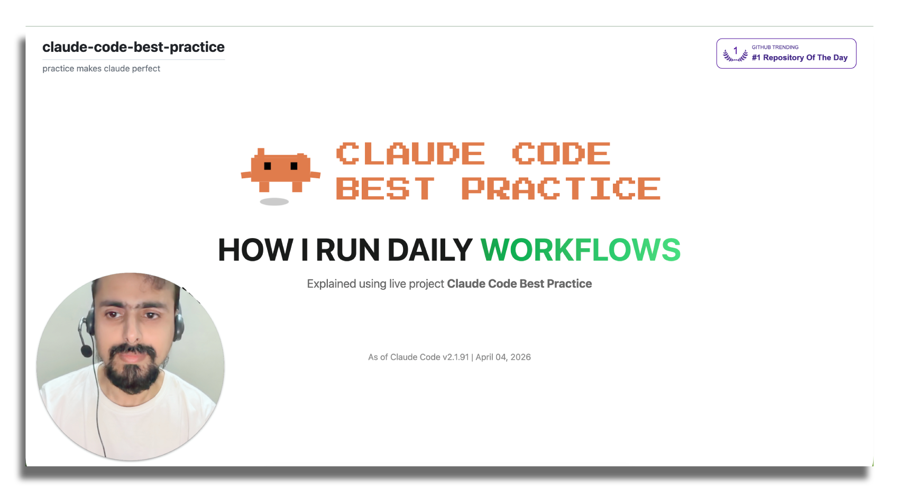
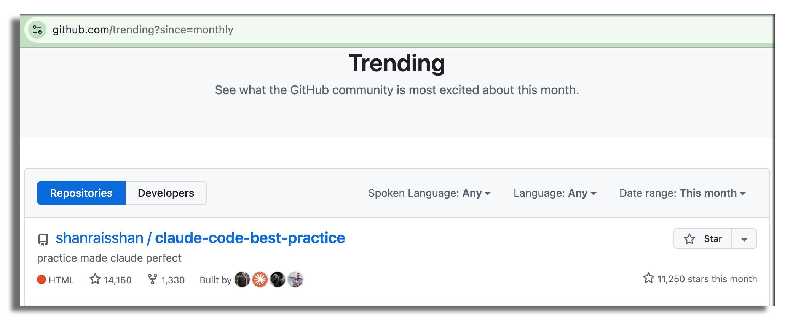

# claude-code-best-practice
从 vibe coding 到 agentic engineering — 实践出真知

-white?style=flat&labelColor=555) <a href="https://github.com/shanraisshan/claude-code-best-practice/stargazers"></a> <br>

[](best-practice/) [](implementation/) [](orchestration-workflow/orchestration-workflow.md) [](https://code.claude.com/docs) [](#-tips-and-tricks) [](#-subscribe) <br>
 = Agent ·  = Command ·  = Skill

<p align="center">
  <br>
  <a href="https://github.com/trending"></a>
</p>

<p align="center">
  <br>
  Boris Cherny 在 X 上（<a href="https://x.com/bcherny/status/2007179832300581177">推文 1</a> · <a href="https://x.com/bcherny/status/2017742741636321619">推文 2</a> · <a href="https://x.com/bcherny/status/2021699851499798911">推文 3</a>）
</p>


## 🧠 概念

| Feature | Location | Description |
|---------|----------|-------------|
|  [**Subagents**](https://code.claude.com/docs/en/sub-agents) | `.claude/agents/<name>.md` | [](best-practice/claude-subagents.md) [](implementation/claude-subagents-implementation.md) Autonomous actor in fresh isolated context — custom tools, permissions, model, memory, and persistent identity |
|  [**Commands**](https://code.claude.com/docs/en/slash-commands) | `.claude/commands/<name>.md` | [](best-practice/claude-commands.md) [](implementation/claude-commands-implementation.md) Knowledge injected into existing context — simple user-invoked prompt templates for workflow orchestration |
|  [**Skills**](https://code.claude.com/docs/en/skills) | `.claude/skills/<name>/SKILL.md` | [](best-practice/claude-skills.md) [](implementation/claude-skills-implementation.md) Knowledge injected into existing context — configurable, preloadable, auto-discoverable, with context forking and progressive disclosure · [Official Skills](https://github.com/anthropics/skills/tree/main/skills) |
| [**Workflows**](https://code.claude.com/docs/en/common-workflows) | [`.claude/commands/weather-orchestrator.md`](.claude/commands/weather-orchestrator.md) | [](orchestration-workflow/orchestration-workflow.md) Step-by-step guides for exploring codebases, fixing bugs, refactoring, and testing — orchestration patterns for multi-step tasks |
| [**Hooks**](https://code.claude.com/docs/en/hooks) | `.claude/hooks/` | [](https://github.com/shanraisshan/claude-code-hooks) [](https://github.com/shanraisshan/claude-code-hooks) User-defined handlers (scripts, HTTP, MCP tools, prompts, agents) that run outside the agentic loop on specific events · [Guide](https://code.claude.com/docs/en/hooks-guide) |
| [**MCP Servers**](https://code.claude.com/docs/en/mcp) | `.claude/settings.json`, `.mcp.json` | [](best-practice/claude-mcp.md) [](.mcp.json) Model Context Protocol connections to external tools, databases, and APIs |
| [**Plugins**](https://code.claude.com/docs/en/plugins) | distributable packages | Bundles of skills, subagents, hooks, MCP servers, and LSP servers · [Marketplaces](https://code.claude.com/docs/en/discover-plugins) · [Create Marketplaces](https://code.claude.com/docs/en/plugin-marketplaces) |
| [**Settings**](https://code.claude.com/docs/en/settings) | `.claude/settings.json` | [](best-practice/claude-settings.md) [](.claude/settings.json) Hierarchical configuration system · [Permissions](https://code.claude.com/docs/en/permissions) · [Model Config](https://code.claude.com/docs/en/model-config) · [Output Styles](https://code.claude.com/docs/en/output-styles) · [Sandboxing](https://code.claude.com/docs/en/sandboxing) · [Keybindings](https://code.claude.com/docs/en/keybindings) · [Fast Mode](https://code.claude.com/docs/en/fast-mode) |
| [**Status Line**](https://code.claude.com/docs/en/statusline) | `.claude/settings.json` | [](https://github.com/shanraisshan/claude-code-status-line) [](.claude/settings.json) Customizable status bar showing context usage, model, cost, and session info |
| [**Memory**](https://code.claude.com/docs/en/memory) | `CLAUDE.md`, `.claude/rules/`, `~/.claude/rules/`, `~/.claude/projects/<project>/memory/` | [](best-practice/claude-memory.md) [](CLAUDE.md) Persistent context via CLAUDE.md files and `@path` imports · [Auto Memory](https://code.claude.com/docs/en/memory) · [Rules](https://code.claude.com/docs/en/memory#organize-rules-with-clauderules) |
| [**Checkpointing**](https://code.claude.com/docs/en/checkpointing) | automatic (git-based) | Automatic tracking of file edits with rewind (`Esc Esc` or `/rewind`) and targeted summarization |
| [**CLI Startup Flags**](https://code.claude.com/docs/en/cli-reference) | `claude [flags]` | [](best-practice/claude-cli-startup-flags.md) Command-line flags, subcommands, and environment variables for launching Claude Code · [Interactive Mode](https://code.claude.com/docs/en/interactive-mode) · [Env Vars](https://code.claude.com/docs/en/env-vars) · `/usage` (merged `/cost`+`/stats` in v2.1.118) |
| **AI Terms** | | [](https://github.com/shanraisshan/claude-code-codex-cursor-gemini/blob/main/reports/ai-terms.md) Agentic Engineering · Context Engineering · Vibe Coding |
| [**Best Practices**](https://code.claude.com/docs/en/best-practices) | | Official best practices · [Prompt Engineering](https://github.com/anthropics/prompt-eng-interactive-tutorial) · [Extend Claude Code](https://code.claude.com/docs/en/features-overview) |

### 🔥 热门

| Feature | Location | Description |
|---------|----------|-------------|
| [**Routines**](https://code.claude.com/docs/en/routines)  | `claude.ai/code/routines`, `/schedule` | Anthropic 基础设施上的云端自动化 — 定时触发、API 触发或 GitHub 事件驱动的后台任务，即使你的电脑关机也能运行 · [桌面任务](https://code.claude.com/docs/en/desktop-scheduled-tasks) |
| [**Ultrareview**](https://code.claude.com/docs/en/ultrareview)  | `/ultrareview` | 云端多 Agent 代码审查 — 每个问题都在远程沙盒中独立复现和验证（5–10 分钟，约 $5–20/次）；Pro/Max 用户每月 3 次免费 · [任务追踪](https://code.claude.com/docs/en/ultrareview#track-a-running-review) |
| [**Devcontainers**](https://code.claude.com/docs/en/devcontainer) | `.devcontainer/` | 预配置的开发容器，具有安全隔离和防火墙规则，确保 Claude Code 环境一致性 |
| [**Channels**](https://code.claude.com/docs/en/channels)  | `--channels`, 基于 plugin | 将 Telegram、Discord 或 webhook 事件推入正在运行的 session — 当你不在时 Claude 也能响应 · [参考文档](https://code.claude.com/docs/en/channels-reference) |
| [**Ultraplan**](https://code.claude.com/docs/en/ultraplan)  | `/ultraplan` | 在云端起草 plan，支持浏览器审查、行内评论和灵活执行 — 远程执行或 teleport 回终端 |
| [**No Flicker Mode**](https://code.claude.com/docs/en/fullscreen)  | `/tui fullscreen`, `CLAUDE_CODE_NO_FLICKER=1` | [](https://x.com/bcherny/status/2039421575422980329) 无闪烁的 alt-screen 渲染，支持鼠标操作、稳定 memory 和应用内滚动 — `/tui fullscreen` 是标准切换方式（v2.1.110+）；环境变量为旧版路径 |
| [**Auto Mode**](https://code.claude.com/docs/en/permission-modes#eliminate-prompts-with-auto-mode)  | `--permission-mode auto`, `Shift+Tab` | [](https://x.com/claudeai/status/2036503582166393240) 后台安全分类器替代手动权限确认 — Claude 自行判断安全性，同时拦截 prompt 注入和危险提权 · `--enable-auto-mode` 参数已移除（v2.1.111）；Max 订阅用户默认开启，使用 Opus 4.7 · [博客](https://claude.com/blog/auto-mode) |
| [**Power-ups**](best-practice/claude-power-ups.md) | `/powerup` | [](best-practice/claude-power-ups.md) 交互式教程，通过动画演示学习 Claude Code 功能（v2.1.90） |
| [**Computer Use**](https://code.claude.com/docs/en/computer-use)  | `computer-use` MCP server | 让 Claude 控制你的屏幕 — 在 macOS 上打开应用、点击、输入和截屏 · [桌面版](https://code.claude.com/docs/en/desktop#let-claude-use-your-computer) |
| [**Agent SDK**](https://code.claude.com/docs/en/agent-sdk/overview) | `npm` / `pip` 包 | 将 Claude Code 作为库构建生产级 AI Agent — Python 和 TypeScript SDK，内置工具、hooks、subagents 和 MCP · [快速开始](https://code.claude.com/docs/en/agent-sdk/quickstart) · [示例](https://github.com/anthropics/claude-agent-sdk-demos) |
| [**Ralph Wiggum Loop**](https://github.com/anthropics/claude-code/tree/main/plugins/ralph-wiggum) | 插件 | [](https://github.com/ghuntley/how-to-ralph-wiggum) [](https://github.com/shanraisshan/novel-llm-26) 面向长期任务的自主开发循环 — 持续迭代直至完成 |
| [**Chrome**](https://code.claude.com/docs/en/chrome)  | `--chrome`, 浏览器扩展 | [](reports/claude-in-chrome-v-chrome-devtools-mcp.md) 通过 Chrome 中的 Claude 实现浏览器自动化 — 测试 Web 应用、调试控制台、自动填写表单、从页面提取数据 |
| [**Claude Code Web**](https://code.claude.com/docs/en/claude-code-on-the-web)  | `claude.ai/code` | 在云端基础设施上运行任务 — 长期任务、PR 自动修复、并行 session，无需本地配置 · [Routines](https://code.claude.com/docs/en/routines) |
| [**Slack**](https://code.claude.com/docs/en/slack) | Slack 中的 `@Claude` | 在团队聊天中 @Claude 并下达编码任务 — 路由至 Claude Code Web session，用于 bug 修复、代码审查和并行任务执行 |
| [**Code Review**](https://code.claude.com/docs/en/code-review)  | GitHub App（托管） | [](https://x.com/claudeai/status/2031088171262554195) 多 Agent PR 分析，发现 bug、安全漏洞和回归问题 · [博客](https://claude.com/blog/code-review) |
| [**GitHub Actions**](https://code.claude.com/docs/en/github-actions) | `.github/workflows/` | 在 CI/CD 流水线中自动化 PR 审查、issue 分类和代码生成 · [GitLab CI/CD](https://code.claude.com/docs/en/gitlab-ci-cd) |
| [**Remote Control**](https://code.claude.com/docs/en/remote-control) | `/remote-control`, `/rc` | [](https://x.com/noahzweben/status/2032533699116355819) 从任何设备继续本地 session — 手机、平板或浏览器 · [无头模式](https://code.claude.com/docs/en/headless) |
| [**Agent Teams**](https://code.claude.com/docs/en/agent-teams)  | 内置（环境变量） | [](https://x.com/bcherny/status/2019472394696683904) [](implementation/claude-agent-teams-implementation.md) 多个 Agent 在同一代码库上并行工作，共享任务协调 |
| [**Scheduled Tasks**](https://code.claude.com/docs/en/scheduled-tasks) | `/loop`, `/schedule`, cron 工具 | [](https://x.com/bcherny/status/2030193932404150413) [](implementation/claude-scheduled-tasks-implementation.md) `/loop` 按循环计划在本地运行 prompt（最长 7 天）— 支持自我调节，Claude 通过 Monitor 工具自行决定执行间隔 · [`/schedule`](https://code.claude.com/docs/en/routines) 在 Anthropic 云端基础设施上运行 prompt — 即使你的电脑关机也能运行 · [公告](https://x.com/noahzweben/status/2036129220959805859) |
| [**Tasks**](https://code.claude.com/docs/en/ultrareview#track-a-running-review) | `/tasks`, `~/.claude/tasks/` | [](reports/claude-global-vs-project-settings.md) 跨 session 的持久任务追踪 — 查看运行中及已完成的后台工作（ultrareview、Agent、定时任务），检查依赖关系；替代已弃用的 TodoWrite 工具 |
| [**Voice Dictation**](https://code.claude.com/docs/en/voice-dictation)  | `/voice` | [](https://x.com/trq212/status/2028628570692890800) 按键语音输入 prompt，支持 20 种语言和可重新绑定的激活键 |
| [**Simplify & Batch**](https://code.claude.com/docs/en/skills#bundled-skills) | `/simplify`, `/batch` | [](https://x.com/bcherny/status/2027534984534544489) 面向代码质量和批量操作的内置 skill — 简化重构以便复用和提升效率，batch 跨文件运行命令 |
| [**Git Worktrees**](https://code.claude.com/docs/en/common-workflows#run-parallel-claude-code-sessions-with-git-worktrees) | 内置, `EnterWorktree`/`ExitWorktree`, `isolation: "worktree"` | [](https://x.com/bcherny/status/2025007393290272904) 基于隔离的 git 分支实现并行开发 — 每个 Agent 拥有独立的工作副本；subagent 可通过 `isolation: "worktree"` frontmatter 在临时 worktree 中运行（v2.1.106+） |

<p align="center">
  
</p>

<a id="orchestration-workflow"></a>

## <a href="orchestration-workflow/orchestration-workflow.md"></a>

详见 [orchestration-workflow](orchestration-workflow/orchestration-workflow.md) 获取  **Command** →  **Agent** →  **Skill** 模式的实现细节。


<p align="center">
  
</p>

<p align="center">
  
</p>


```bash
claude
/weather-orchestrator
```

<p align="center">
  
</p>

## ⚙️ 开发工作流

所有主要工作流都遵循同一架构模式：**调研 → 规划 → 执行 → 审查 → 交付**

| Name | ★ | Uniqueness | Plan |  |  |  |
|------|---|------------|------|---|---|---|
| [Superpowers](https://github.com/obra/superpowers) | 166k |    |  [writing-plans](https://github.com/obra/superpowers/tree/main/skills/writing-plans) | 5 | 3 | 14 |
| [Everything Claude Code](https://github.com/affaan-m/everything-claude-code) | 165k |    |  [planner](https://github.com/affaan-m/everything-claude-code/blob/main/agents/planner.md) | 48 | 143 | 230 |
| [Spec Kit](https://github.com/github/spec-kit) | 90k |    |  [speckit.plan](https://github.com/github/spec-kit/blob/main/templates/commands/plan.md) | 0 | 9+ | 0 |
| [gstack](https://github.com/garrytan/gstack) | 81k |    |  [autoplan](https://github.com/garrytan/gstack/tree/main/autoplan) | 0 | 0 | 41 |
| [Get Shit Done](https://github.com/gsd-build/get-shit-done) | 57k |    |  [gsd-planner](https://github.com/gsd-build/get-shit-done/blob/main/agents/gsd-planner.md) | 33 | 122 | 0 |
| [BMAD-METHOD](https://github.com/bmad-code-org/BMAD-METHOD) | 46k |    |  [bmad-create-prd](https://github.com/bmad-code-org/BMAD-METHOD/tree/main/src/bmm-skills/2-plan-workflows/bmad-create-prd) | 0 | 0 | 40 |
| [OpenSpec](https://github.com/Fission-AI/OpenSpec) | 43k |    |  [opsx:propose](https://github.com/Fission-AI/OpenSpec/blob/main/src/commands/workflow/new-change.ts) | 0 | 11 | 0 |
| [oh-my-claudecode](https://github.com/Yeachan-Heo/oh-my-claudecode) | 31k |    |  [ralplan](https://github.com/Yeachan-Heo/oh-my-claudecode/tree/main/skills/ralplan) | 19 | 0 | 46 |
| [Compound Engineering](https://github.com/EveryInc/compound-engineering-plugin) | 15k |    |  [ce-plan](https://github.com/EveryInc/compound-engineering-plugin/tree/main/plugins/compound-engineering/skills/ce-plan) | 60 | 4 | 42 |
| [HumanLayer](https://github.com/humanlayer/humanlayer) | 11k |    |  [create_plan](https://github.com/humanlayer/humanlayer/blob/main/.claude/commands/create_plan.md) | 6 | 27 | 0 |

### 其他
- [跨 Model 工作流（Claude Code + Codex）](development-workflows/cross-model-workflow/cross-model-workflow.md) [](development-workflows/cross-model-workflow/cross-model-workflow.md)
- [RPI](development-workflows/rpi/rpi-workflow.md) [](development-workflows/rpi/rpi-workflow.md)
- [Ralph Wiggum Loop](https://www.youtube.com/watch?v=eAtvoGlpeRU) [](https://github.com/shanraisshan/novel-llm-26)
- [Andrej Karpathy（OpenAI 创始成员）工作流](https://x.com/karpathy/status/2015883857489522876)
- [Peter Steinberger（OpenClaw 创始人）工作流](https://youtu.be/8lF7HmQ_RgY?t=2582)
- Boris Cherny（Claude Code 创始人）工作流 — [13 个技巧](tips/claude-boris-13-tips-03-jan-26.md) · [10 个技巧](tips/claude-boris-10-tips-01-feb-26.md) · [12 个技巧](tips/claude-boris-12-tips-12-feb-26.md) · [2 个技巧](tips/claude-boris-2-tips-25-mar-26.md) · [15 个技巧](tips/claude-boris-15-tips-30-mar-26.md) · [6 个技巧](tips/claude-boris-6-tips-16-apr-26.md) [](https://x.com/bcherny)
- Thariq (Anthropic) 工作流 — [Skills](tips/claude-thariq-tips-17-mar-26.md) · [Session Management](tips/claude-thariq-tips-16-apr-26.md) [](https://x.com/trq212)

<p align="center">
  
</p>

## 💡 TIPS AND TRICKS (82)

🚫👶 = 不要保姆式手把手

[Prompting](#tips-prompting) · [Planning](#tips-planning) · [Context](#tips-context) · [Session](#tips-session) · [CLAUDE.md + .claude/rules](#tips-claudemd) · [Agents](#tips-agents) · [Commands](#tips-commands) · [Skills](#tips-skills) · [Hooks](#tips-hooks) · [Workflows](#tips-workflows) · [Advanced](#tips-workflows-advanced) · [Git / PR](#tips-git-pr) · [Debugging](#tips-debugging) · [Utilities](#tips-utilities) · [Daily](#tips-daily)


<a id="tips-prompting"></a>■ **Prompting (3)**

| Tip | Source |
|-----|--------|
| 挑战 Claude — 「就这些改动好好拷问我，我通过你的测试之前别开 PR。」或者「证明给我看它能跑」然后让 Claude diff main 和你的分支 🚫👶 | [](https://x.com/bcherny/status/2017742752566632544) |
| 修复效果一般后 — 「既然你现在了解所有情况了，把这个扔掉，实现一个优雅的解决方案」🚫👶 | [](https://x.com/bcherny/status/2017742752566632544) |
| Claude 能自己修大部分 bug — 把 bug 贴进去，说「fix」，别微观管理它怎么修 🚫👶 | [](https://x.com/bcherny/status/2017742750473720121) |

<a id="tips-planning"></a>■ **Planning/Specs (6)**

| Tip | Source |
|-----|--------|
| 始终从 [plan mode](https://code.claude.com/docs/en/common-workflows) 开始 | [](https://x.com/bcherny/status/2007179845336527000) |
| 从一个最小 spec 或 prompt 开始，让 Claude 用 [AskUserQuestion](https://code.claude.com/docs/en/cli-reference) 工具采访你，然后开一个新 session 来执行 spec | [](https://x.com/trq212/status/2005315275026260309) |
| 始终制定分阶段、带门禁的计划，每个阶段都要有多个测试（unit、automation、integration） | [](videos/claude-dex-mlops-community-24-mar-26.md) [](https://youtu.be/YwZR6tc7qYg?t=1032) |
| 启动第二个 Claude 以 staff engineer 的视角 review 你的计划，或者用 [cross-model](development-workflows/cross-model-workflow/cross-model-workflow.md) 来 review | [](https://x.com/bcherny/status/2017742745365057733) |
| 在把工作交给 Claude 之前写详细的 spec，减少歧义 —— 你描述得越具体，输出质量越好 | [](https://x.com/bcherny/status/2017742752566632544) |
| 原型 > PRD —— 构建 20-30 个版本而不是写 spec，构建成本很低，多试几轮 | [](https://youtu.be/julbw1JuAz0?t=3630) [](https://youtu.be/julbw1JuAz0?t=3630) |

<a id="tips-context"></a>■ **Context (5)**

| Tip | Source |
|-----|--------|
| context rot 在 1M context 模型上大约 300-400k tokens 时开始发作 —— 对于需要高智能的任务，别让 session 超过这个范围 | [](tips/claude-thariq-tips-16-apr-26.md) |
| 降智区大约在 40% context 左右 —— 「到了这个点结果就开始变差」。新手建议：「保持在 40% 以下，到 60% 就该考虑收尾了」。老手建议：「积极控制在 30% 以下」—— 只有简单任务才推到 60%。切换任务时手动 [/compact](https://code.claude.com/docs/en/interactive-mode) 或 [/clear](https://code.claude.com/docs/en/cli-reference) 来重置 | [](videos/claude-dex-mlops-community-24-mar-26.md) [](https://youtu.be/YwZR6tc7qYg?t=1541) |
| rewind > 纠正 —— 用 double-Esc 或 [/rewind](https://code.claude.com/docs/en/checkpointing) 回退到失败尝试之前，用你学到的经验重新 prompt，而不是让失败的尝试和纠正污染 context 🚫👶 | [](tips/claude-thariq-tips-16-apr-26.md) |
| [/compact](https://code.claude.com/docs/en/interactive-mode) 时带上提示（/compact 聚焦在 auth 重构上，去掉 test 调试的部分）比等 autocompact 自动触发更好 —— 模型在 context rot 时自动 compact 的状态是它最不智能的时候 | [](tips/claude-thariq-tips-16-apr-26.md) |
| 用 subagents 来管理 context —— 问问自己「我还会需要这个 tool output 吗，还是只需要结论？」—— 20 次文件读取 + 12 次 grep + 3 条死胡同都留在子 agent 的 context 里，只有最终报告返回 🚫👶 | [](tips/claude-thariq-tips-16-apr-26.md) |

<a id="tips-session"></a>■ **Session Management (6)**

| Tip | Source |
|-----|--------|
| 每个 turn 都是一个分支点 —— Claude 结束一个 turn 后，根据你需要保留多少现有 context，在 Continue、/rewind、/clear、/compact 或 Subagent 之间选择 | [](tips/claude-thariq-tips-16-apr-26.md) |
| 新任务 = 新 session —— 相关任务（比如为你刚构建的东西写文档）可以复用 context 提高效率，但真正的新任务值得一个全新的 session | [](tips/claude-thariq-tips-16-apr-26.md) |
| 在 rewind 之前用「summarize from here」让 Claude 写一条交接信息 —— 就像未来的 Claude 给过去的自己留个便条 | [](tips/claude-thariq-tips-16-apr-26.md) |
| /compact vs /clear —— compact 是有损但保持动量的（任务中途，细节模糊没关系）；/clear + 简要说明工作量更大，但你能精确控制保留什么（高风险下一步时） | [](tips/claude-thariq-tips-16-apr-26.md) |
| 长时间 session 用 recaps —— Claude 做了什么、下一步是什么的简短总结，离开几分钟或几小时后回来时很有用。在 /config 里用 recaps 关闭 | [](tips/claude-boris-6-tips-16-apr-26.md) |
| 用 [/rename](https://code.claude.com/docs/en/cli-reference) 给重要 session 命名（比如 [TODO - refactor task]），之后用 [/resume](https://code.claude.com/docs/en/cli-reference) 恢复 —— 同时跑多个 Claude 时给每个实例做好标签 | [](https://every.to/podcast/how-to-use-claude-code-like-the-people-who-built-it) |

<a id="tips-claudemd"></a>■ **CLAUDE.md + .claude/rules (8)**

| Tip | Source |
|-----|--------|
| [CLAUDE.md](https://code.claude.com/docs/en/memory) 每个文件应控制在 [200 行](https://code.claude.com/docs/en/memory#write-effective-instructions)以内。[humanlayer 60 行示例](https://www.humanlayer.dev/blog/writing-a-good-claude-md)（[但仍然不能 100% 保证生效](https://www.reddit.com/r/ClaudeCode/comments/1qn9pb9/claudemd_says_must_use_agent_claude_ignores_it_80/)） | [](https://x.com/bcherny/status/2007179840848597422) [](https://www.humanlayer.dev/blog/writing-a-good-claude-md) |
| .claude/rules/*.md 会像 CLAUDE.md 一样自动加载到每个 session —— 添加 paths: YAML frontmatter 来让它们在 Claude 触及匹配 glob 的文件时才懒加载 | [](https://code.claude.com/docs/en/memory#organize-rules-with-clauderules) |
| 用 [\<important if="..."\> tags](https://www.hlyr.dev/blog/stop-claude-from-ignoring-your-claude-md) 包裹领域特定的 CLAUDE.md 规则，防止文件变长后 Claude 忽略它们 | [](https://www.hlyr.dev/blog/stop-claude-from-ignoring-your-claude-md) |
| monorepo 用 [多个 CLAUDE.md](best-practice/claude-memory.md) —— 祖先 + 后代加载机制 | [](https://x.com/bcherny/status/2016339448863355206) |
| 用 [.claude/rules/](https://code.claude.com/docs/en/memory#organize-rules-with-clauderules) 来拆分大型指令 | [](https://code.claude.com/docs/en/memory#organize-rules-with-clauderules) |
| 任何开发者都应该能启动 Claude、说「run the tests」然后一次跑通 —— 如果不行，说明你的 CLAUDE.md 缺少必要的 setup/build/test 命令 | [](https://x.com/dexhorthy/status/2034713765401551053) |
| 保持代码库整洁，完成迁移 —— 部分迁移的框架会让模型困惑，可能选错模式 | [](https://youtu.be/julbw1JuAz0?t=1112) [](https://youtu.be/julbw1JuAz0?t=1112) |
| 用 [settings.json](best-practice/claude-settings.md) 来强制执行行为（attribution、权限、model）—— 别把「NEVER add Co-Authored-By」写在 CLAUDE.md 里，用 attribution.commit: "" 才是确定性的做法 | [](https://x.com/dani_avila7/status/2036182734310195550) |

<a id="tips-agents"></a> **Agents (4)**

| Tip | Source |
|-----|--------|
| 用面向功能特性的 [sub-agents](https://code.claude.com/docs/en/sub-agents)（额外 context）配合 [skills](https://code.claude.com/docs/en/skills)（渐进式披露），而不是通用的 qa、backend engineer 角色 | [](https://x.com/bcherny/status/2007179850139000872) |
| 说「use subagents」来投入更多算力解决问题 —— 把任务卸载出去，保持主 context 干净和聚焦 🚫👶 | [](https://x.com/bcherny/status/2017742755737555434) |
| [agent teams with tmux](https://code.claude.com/docs/en/agent-teams) 和 [git worktrees](https://x.com/bcherny/status/2025007393290272904) 用于并行开发 | [](https://x.com/bcherny/status/2025007393290272904) |
| 用 [test time compute](https://code.claude.com/docs/en/sub-agents) —— 独立的 context window 能让结果更好；一个 agent 引入 bug，另一个（同模型）能发现它们 | [](https://x.com/bcherny/status/2031151689219321886) |

<a id="tips-commands"></a> **Commands (3)**

| Tip | Source |
|-----|--------|
| 用 [commands](https://code.claude.com/docs/en/slash-commands) 来处理你的工作流，而不是用 [sub-agents](https://code.claude.com/docs/en/sub-agents) | [](https://x.com/bcherny/status/2007179847949500714) |
| 为你每天多次重复的「inner loop」工作流使用 [slash commands](https://code.claude.com/docs/en/slash-commands) —— 节省重复 prompt，commands 放在 .claude/commands/ 里并随 git 提交 | [](https://x.com/bcherny/status/2007179847949500714) |
| 如果你做的事情超过一天一次，把它做成一个 [skill](https://code.claude.com/docs/en/skills) 或 [command](https://code.claude.com/docs/en/slash-commands) —— 构建 /techdebt、context-dump 或 analytics 命令 | [](https://x.com/bcherny/status/2017742748984742078) |

<a id="tips-skills"></a> **Skills (9)**

| Tip | Source |
|-----|--------|
| 用 [context: fork](https://code.claude.com/docs/en/skills) 在隔离的 subagent 里运行 skill —— 主 context 只看到最终结果，看不到中间的工具调用。agent 字段可以设置 subagent 类型 | [](https://x.com/lydiahallie/status/2033603164398883042) |
| monorepo 用 [子文件夹里的 skills](reports/claude-skills-for-larger-mono-repos.md) | [](https://code.claude.com/docs/en/skills) |
| skills 是文件夹，不是文件 —— 用 references/、scripts/、examples/ 子目录来做 [渐进式披露](https://code.claude.com/docs/en/skills) | [](https://x.com/trq212/status/2033949937936085378) |
| 每个 skill 里建一个 Gotchas 部分 —— 信息密度最高的内容，随时间积累 Claude 的失败点 | [](https://x.com/trq212/status/2033949937936085378) |
| skill description 字段是触发器，不是摘要 —— 写给模型看（「什么时候该触发我？」） | [](https://x.com/trq212/status/2033949937936085378) |
| skill 里别写废话 —— 专注在能把 Claude 从默认行为中拉出来的内容 🚫👶 | [](https://x.com/trq212/status/2033949937936085378) |
| 别在 skill 里给 Claude 规定死步骤 —— 给目标和约束，不要逐步指令 🚫👶 | [](https://x.com/trq212/status/2033949937936085378) |
| skill 里包含脚本和库，让 Claude 组合使用而不是重新构造样板代码 | [](https://x.com/trq212/status/2033949937936085378) |
| 在 SKILL.md 中嵌入 !command 来把动态 shell 输出注入 prompt —— Claude 在调用时运行它，模型只看到结果 | [](https://x.com/lydiahallie/status/2034337963820327017) |

<a id="tips-hooks"></a>■ **Hooks (5)**

| Tip | Source |
|-----|--------|
| 在 skills 里使用 [按需 hooks](https://code.claude.com/docs/en/skills) —— /careful 阻止破坏性命令，/freeze 阻止目录外的编辑 | [](https://x.com/trq212/status/2033949937936085378) |
| 用 PreToolUse hook [统计 skill 使用频率](https://code.claude.com/docs/en/skills)，找出热门或触发不足的 skills | [](https://x.com/trq212/status/2033949937936085378) |
| 用 [PostToolUse hook](https://code.claude.com/docs/en/hooks) 自动格式化代码 —— Claude 生成格式良好的代码，hook 处理最后 10% 避免 CI 报错 | [](https://x.com/bcherny/status/2007179852047335529) |
| 通过 hook 将 [权限请求](https://code.claude.com/docs/en/hooks) 路由给 Opus —— 让它扫描攻击并自动批准安全的请求 🚫👶 | [](https://x.com/bcherny/status/2017742755737555434) |
| 用 [Stop hook](https://code.claude.com/docs/en/hooks) 在 turn 结束时提醒 Claude 继续或验证它的工作 | [](https://x.com/bcherny/status/2021701059253874861) |

<a id="tips-workflows"></a>■ **Workflows (5)**

| Tip | Source |
|-----|--------|
| 用 [/model](https://code.claude.com/docs/en/model-config) 选择模型和 reasoning，[/context](https://code.claude.com/docs/en/interactive-mode) 查看 context 用量，[/usage](https://code.claude.com/docs/en/costs) 检查 plan 限额，[/extra-usage](https://code.claude.com/docs/en/interactive-mode) 配置溢出计费，[/config](https://code.claude.com/docs/en/settings) 配置设置 —— 用 Opus 做 plan mode，用 Sonnet 写代码，两者兼得 | [](https://x.com/_catwu/status/1955694117264261609) |
| 始终在 [/config](https://code.claude.com/docs/en/settings) 中开启 [thinking mode](https://code.claude.com/docs/en/model-config) true（查看推理过程）和 [Output Style](https://code.claude.com/docs/en/output-styles) Explanatory（查看带 ★ Insight 框的详细输出），以更好地理解 Claude 的决策 | [](https://x.com/bcherny/status/2007179838864666847) |
| 在 prompt 中使用 ultrathink 关键词来触发 [高投入推理](https://docs.anthropic.com/en/docs/build-with-claude/extended-thinking#tips-and-best-practices) | [](https://docs.anthropic.com/en/docs/build-with-claude/extended-thinking#tips-and-best-practices) |
| /focus 模式隐藏所有中间过程，只显示最终结果 —— 信任模型执行正确的命令，只看结果（用 /focus 切换） | [](tips/claude-boris-6-tips-16-apr-26.md) |
| 用 Opus 4.7 的 adaptive thinking 调节努力程度 —— low 追求速度和更少 token，max 追求最强智能（滑块：low · medium · high · xhigh · max） | [](tips/claude-boris-6-tips-16-apr-26.md) |

<a id="tips-workflows-advanced"></a>■ **Workflows Advanced (9)**
| 技巧 | 来源 |
|-----|--------|
| 大量使用 ASCII 图表来理解你的架构 | [](https://x.com/bcherny/status/2017742759218794768) |
| 使用 [/loop](https://code.claude.com/docs/en/scheduled-tasks) 进行本地周期性监控（最长 7 天）· 使用 [/schedule](https://code.claude.com/docs/en/routines) 进行基于云的周期性任务，即使机器关机也能运行 | [](https://x.com/bcherny/status/2038454341884154269) |
| 使用 [Ralph Wiggum 插件](https://github.com/shanraisshan/novel-llm-26) 处理长时间运行的自主任务 | [](https://x.com/bcherny/status/2007179858435281082) |
| [/permissions](https://code.claude.com/docs/en/permissions) 使用通配符语法（Bash(npm run *)、Edit(/docs/**)），而不是危险的 dangerously-skip-permissions | [](https://x.com/bcherny/status/2007179854077407667) |
| [/sandbox](https://code.claude.com/docs/en/sandboxing) 通过文件和网络隔离减少权限提示 —— 内部减少 84% | [](https://x.com/bcherny/status/2021700506465579443) [](https://creatoreconomy.so/p/inside-claude-code-how-an-ai-native-actually-works-cat-wu) |
| 投资 [product verification](https://code.claude.com/docs/en/skills) Skill（如 signup-flow-driver、checkout-verifier）—— 花一周时间打磨是值得的 | [](https://x.com/trq212/status/2033949937936085378) |
| 使用 [auto mode](https://code.claude.com/docs/en/permission-modes#eliminate-prompts-with-auto-mode) 代替 dangerously-skip-permissions —— 一个基于模型的分类器判断每条命令是否安全并自动批准，有风险时暂停询问。Shift+Tab 切换 Ask → Plan → Auto 模式 🚫👶 | [](tips/claude-boris-6-tips-16-apr-26.md) |
| 使用 /less-permission-prompt Skill 扫描会话历史中反复提示的安全 bash/MCP 命令，然后获取推荐的 allowlist 粘贴到 [settings](best-practice/claude-settings.md) | [](tips/claude-boris-6-tips-16-apr-26.md) |
| 构建一个 /go Skill，(1) 通过 bash/browser/computer use 进行端到端测试 (2) 运行 /simplify (3) 提交 PR —— 这样你回来时就能知道代码可以正常工作 🚫👶 | [](tips/claude-boris-6-tips-16-apr-26.md) |

<a id="tips-git-pr"></a>■ **Git / PR (5)**

| 技巧 | 来源 |
|-----|--------|
| 保持 PR 小而聚焦 —— [中位数 118 行](tips/claude-boris-2-tips-25-mar-26.md)（一天内 141 个 PR，45K 行变更），每个 PR 一个功能，更容易 review 和 revert | [](https://x.com/bcherny/status/2038552880018538749) |
| 始终使用 [squash merge](tips/claude-boris-2-tips-25-mar-26.md) 合并 PR —— 干净线性的历史，每个功能一个 commit，方便 git revert 和 git bisect | [](https://x.com/bcherny/status/2038552880018538749) |
| 频繁 commit —— 尽量每小时至少 commit 一次，任务完成后立刻 commit |  |
| 在同事的 PR 上 tag [@claude](https://github.com/apps/claude) 来自动生成周期性 review 反馈的 lint 规则 —— 把自己从 code review 中解放出来 🚫👶 | [](https://youtu.be/julbw1JuAz0?t=2715) [](https://youtu.be/julbw1JuAz0?t=2715) |
| 使用 [/code-review](https://code.claude.com/docs/en/code-review) 进行多 Agent PR 分析 —— 在合并前捕获 bug、安全漏洞和回归问题 | [](https://x.com/bcherny/status/2031089411820228645) |

<a id="tips-debugging"></a>■ **Debugging (6)**

| 技巧 | 来源 |
|-----|--------|
| 养成习惯：遇到任何问题时截图分享给 Claude |  |
| 使用 MCP（[Claude in Chrome](https://code.claude.com/docs/en/chrome)、[Playwright](https://github.com/microsoft/playwright-mcp)、[Chrome DevTools](https://developer.chrome.com/blog/chrome-devtools-mcp)）让 Claude 自动查看 chrome console 日志 | [](https://code.claude.com/docs/en/chrome) |
| 总是让 Claude 将你想查看日志的终端作为后台任务运行，以便更好地调试 |  |
| [/doctor](https://code.claude.com/docs/en/cli-reference) 诊断安装、认证和配置问题 |  |
| 使用 [cross-model](development-workflows/cross-model-workflow/cross-model-workflow.md) 进行 QA —— 例如用 [Codex](https://github.com/shanraisshan/codex-cli-best-practice) 进行 plan 和 implementation review |  |
| Agentic search（glob + grep）胜过 RAG —— Claude Code 尝试后放弃了向量数据库，因为代码会过时且权限管理复杂 | [](https://youtu.be/julbw1JuAz0?t=3095) [](https://youtu.be/julbw1JuAz0?t=3095) |

<a id="tips-utilities"></a>■ **Utilities (5)**

| 技巧 | 来源 |
|-----|--------|
| 使用 [iTerm](https://iterm2.com/)/[Ghostty](https://ghostty.org/)/[tmux](https://github.com/tmux/tmux) 终端而不是 IDE（[VS Code](https://code.visualstudio.com/)/[Cursor](https://www.cursor.com/)） | [](https://x.com/bcherny/status/2017742753971769626) |
| [/voice](https://code.claude.com/docs/en/voice-dictation) 或 [Wispr Flow](https://wisprflow.ai) 进行语音 prompt（10 倍生产力） | [](https://x.com/bcherny/status/2038454362226467112) |
| [claude-code-hooks](https://github.com/shanraisshan/claude-code-hooks) 用于 Claude 反馈 |  |
| [status line](https://github.com/shanraisshan/claude-code-status-line) 用于 context 感知和快速 compacting | [](https://x.com/bcherny/status/2021700784019452195)  |
| 探索 [settings.json](best-practice/claude-settings.md) 功能，如 [Plans Directory](best-practice/claude-settings.md#plans-directory)、[Spinner Verbs](best-practice/claude-settings.md#display--ux)，打造个性化体验 | [](https://x.com/bcherny/status/2021701145023197516) |

<a id="tips-daily"></a>■ **Daily (2)**

| 技巧 | 来源 |
|-----|--------|
| 每天 [更新](https://code.claude.com/docs/en/setup) Claude Code |  |
| 每天开始时阅读 [changelog](https://github.com/anthropics/claude-code/blob/main/CHANGELOG.md) |  |


| 文章 / 推文 | 来源 |
|-----------------|--------|
| [6 个充分利用 Opus 4.7 的技巧（Boris）\| 2026年4月16日](tips/claude-boris-6-tips-16-apr-26.md) | [推文](https://x.com/bcherny) |
| [Session Management & 1M Context（Thariq）\| 2026年4月16日](tips/claude-thariq-tips-16-apr-26.md) | [推文](https://x.com/trq212) |
| [Claude Code 中 15 个隐藏和未被充分利用的功能（Boris）\| 2026年3月30日](tips/claude-boris-15-tips-30-mar-26.md) | [推文](https://x.com/bcherny/status/2038454336355999749) |
| [Squash 合并 & PR 大小分布（Boris）\| 2026年3月25日](tips/claude-boris-2-tips-25-mar-26.md) | [推文](https://x.com/bcherny/status/2038552880018538749) |
| [构建 Claude Code 的经验：如何使用 Skills（Thariq）\| 2026年3月17日](tips/claude-thariq-tips-17-mar-26.md) | [文章](https://x.com/trq212/status/2033949937936085378) |
| [Code Review & Test Time Compute（Boris）\| 2026年3月10日](tips/claude-boris-2-tips-10-mar-26.md) | [推文](https://x.com/bcherny/status/2031089411820228645) |
| /loop —— 安排最多 3 天的周期性任务（Boris）\| 2026年3月7日 | [推文](https://x.com/bcherny/status/2030193932404150413) |
| AskUserQuestion + ASCII Markdown（Thariq）\| 2026年2月28日 | [推文](https://x.com/trq212/status/2027543858289250472) |
| Seeing like an Agent —— 构建 Claude Code 的经验教训（Thariq）\| 2026年2月28日 | [文章](https://x.com/trq212/status/2027463795355095314) |
| Git Worktrees —— Boris 的 5 种用法 \| 2026年2月21日 | [推文](https://x.com/bcherny/status/2025007393290272904) |
| 构建 Claude Code 的经验：Prompt 缓存就是一切（Thariq）\| 2026年2月20日 | [文章](https://x.com/trq212/status/2024574133011673516) |
| [人们定制自己 Claude 的 12 种方式（Boris）\| 2026年2月12日](tips/claude-boris-12-tips-12-feb-26.md) | [推文](https://x.com/bcherny/status/2021699851499798911) |
| [团队使用 Claude Code 的 10 个技巧（Boris）\| 2026年2月1日](tips/claude-boris-10-tips-01-feb-26.md) | [推文](https://x.com/bcherny/status/2017742741636321619) |
| [我如何使用 Claude Code —— 13 个来自我出奇简洁的设置的技巧（Boris）\| 2026年1月3日](tips/claude-boris-13-tips-03-jan-26.md) | [推文](https://x.com/bcherny/status/2007179832300581177) |
| 用 AskUserQuestion 工具让 Claude 采访你（Thariq）\| 2025年12月28日 | [推文](https://x.com/trq212/status/2005315275026260309) |
| 始终使用 plan mode，给 Claude 一种验证方式，使用 /code-review（Boris）\| 2025年12月27日 | [推文](https://x.com/bcherny/status/2004711722926616680) |

<p align="center">
  
</p>

## 🎬 视频 / 播客

| 视频 / 播客 | 来源 | YouTube |
|-----------------|--------|---------|
| 我们对 Research-Plan-Implement 的一切误解（Dex）\| 2026年3月24日 \| MLOps Community | [](https://x.com/daborhyde) | [YouTube](https://youtu.be/YwZR6tc7qYg) |
| 与 Boris Cherny 构建 Claude Code（Boris）\| 2026年3月4日 \| The Pragmatic Engineer | [](https://x.com/bcherny) | [YouTube](https://youtu.be/julbw1JuAz0) |
| Claude Code 负责人：编程问题解决后会发生什么（Boris）\| 2026年2月19日 \| Lenny's Podcast | [](https://x.com/bcherny) | [YouTube](https://youtu.be/We7BZVKbCVw) |
| 与 Claude Code 创建者 Boris Cherny 深入了解（Boris）\| 2026年2月17日 \| Y Combinator | [](https://x.com/bcherny) | [YouTube](https://youtu.be/PQU9o_5rHC4) |
| Boris Cherny（Claude Code 创建者）谈职业成长（Boris）\| 2025年12月15日 \| Ryan Peterman | [](https://x.com/bcherny) | [YouTube](https://youtu.be/AmdLVWMdjOk) |
| Claude Code 的秘密 —— 来自构建它的工程师们（Cat）\| 2025年10月29日 \| Every | [](https://x.com/bcherny) | [YouTube](https://youtu.be/IDSAMqip6ms) |

<p align="center">
  
</p>

## 🔔 订阅

| 来源 | 名称 | 徽章 |
|--------|------|-------|
|  | [r/ClaudeAI](https://www.reddit.com/r/ClaudeAI/), [r/ClaudeCode](https://www.reddit.com/r/ClaudeCode/), [r/Anthropic](https://www.reddit.com/r/Anthropic/) |  |
|  | [Claude](https://x.com/claudeai), [Claude Devs](https://x.com/ClaudeDevs), [Anthropic](https://x.com/AnthropicAI), [Boris](https://x.com/bcherny), [Thariq](https://x.com/trq212), [Cat](https://x.com/_catwu), [Lydia](https://x.com/lydiahallie), [Noah](https://x.com/noahzweben), [Anthony](https://x.com/amorriscode), [Alex](https://x.com/alexalbert__), [Kenneth](https://x.com/neilhtennek) |  |
|  | [Jesse Kriss](https://x.com/obra) ([Superpowers](https://github.com/obra/superpowers)), [Affaan Mustafa](https://x.com/affaanmustafa) ([ECC](https://github.com/affaan-m/everything-claude-code)), [Garry Tan](https://x.com/garrytan) ([gstack](https://github.com/garrytan/gstack)), [Dex Horthy](https://x.com/dexhorthy) ([HumanLayer](https://github.com/humanlayer/humanlayer)), [Kieran Klaassen](https://x.com/kieranklaassen) ([Compound Eng](https://github.com/EveryInc/compound-engineering-plugin)), [Tabish Gilani](https://x.com/0xTab) ([OpenSpec](https://github.com/Fission-AI/OpenSpec)), [Brian McAdams](https://x.com/BMadCode) ([BMAD](https://github.com/bmad-code-org/BMAD-METHOD)), [Lex Christopherson](https://x.com/official_taches) ([GSD](https://github.com/gsd-build/get-shit-done)), [Dani Avila](https://x.com/dani_avila7) ([CC 模板](https://github.com/davila7/claude-code-templates)), [Dan Shipper](https://x.com/danshipper) ([Every](https://every.to/)), [Andrej Karpathy](https://x.com/karpathy) ([AutoResearch](https://x.com/karpathy/status/2015883857489522876)), [Peter Steinberger](https://x.com/steipete) ([OpenClaw](https://x.com/openclaw)), [Sigrid Jin](https://x.com/realsigridjin) ([claw-code](https://github.com/ultraworkers/claw-code)), [Yeachan Heo](https://x.com/bellman_ych) ([oh-my-claudecode](https://github.com/Yeachan-Heo/oh-my-claudecode)) |  |
|  | [Anthropic](https://www.youtube.com/@anthropic-ai) |  |
|  | [Lenny's Podcast](https://www.youtube.com/@LennysPodcast), [Y Combinator](https://www.youtube.com/@ycombinator), [The Pragmatic Engineer](https://www.youtube.com/@pragmaticengineer), [Ryan Peterman](https://www.youtube.com/@ryanlpeterman), [Every](https://www.youtube.com/@every_media), [MLOps Community](https://www.youtube.com/@MLOps) |  |

<p align="center">
  
</p>

## ☠️ 创业公司 / 商业

| Claude | 被替代 |
|-|-|
|[**Code Review**](https://code.claude.com/docs/en/code-review)|[Greptile](https://greptile.com), [CodeRabbit](https://coderabbit.ai), [Devin Review](https://devin.ai), [OpenDiff](https://opendiff.com), [Cursor BugBot](https://bugbot.dev)|
|[**Voice Dictation**](https://code.claude.com/docs/en/voice-dictation)|[Wispr Flow](https://wisprflow.ai), [SuperWhisper](https://superwhisper.com/)|
|[**Remote Control**](https://code.claude.com/docs/en/remote-control)|[OpenClaw](https://openclaw.ai/)
|[**Claude in Chrome**](https://code.claude.com/docs/en/chrome)|[Playwright MCP](https://github.com/microsoft/playwright-mcp), [Chrome DevTools MCP](https://developer.chrome.com/blog/chrome-devtools-mcp)|
|[**Computer Use**](https://docs.anthropic.com/en/docs/agents-and-tools/computer-use)|[OpenAI CUA](https://openai.com/index/computer-using-agent/)|
|[**Cowork**](https://claude.com/blog/cowork-research-preview)|[ChatGPT Agent](https://openai.com/chatgpt/agent/), [Perplexity Computer](https://www.perplexity.ai/computer/), [Manus](https://manus.im)|
|[**Tasks**](https://x.com/trq212/status/2014480496013803643)|[Beads](https://github.com/steveyegge/beads)
|[**Plan Mode**](https://code.claude.com/docs/en/common-workflows)|[Agent OS](https://github.com/buildermethods/agent-os)|
|[**Skills / Plugins**](https://code.claude.com/docs/en/plugins)|YC AI 包装创业公司（[reddit](https://reddit.com/r/ClaudeAI/comments/1r6bh4d/claude_code_skills_are_basically_yc_ai_startup/)）|

<p align="center">
  
</p>
</p>

<a id="billion-dollar-questions"></a>


*如果你有答案，请告诉我：shanraisshan@gmail.com*

**Memory & Instructions（4）**

1. 你的 CLAUDE.md 里到底应该放什么——又该排除什么？
2. 如果已经有了 CLAUDE.md，还需要单独的 constitution.md 或 rules.md 吗？
3. 多久应该更新一次 CLAUDE.md？如何判断它已经过时了？
4. 为什么 Claude 仍然会无视 CLAUDE.md 中的指令——即使你用了全大写的 MUST？（[reddit](https://reddit.com/r/ClaudeCode/comments/1qn9pb9/claudemd_says_must_use_agent_claude_ignores_it_80/)）

**Agents, Skills & Workflows（6）**

1. 什么时候该用 command vs agent vs skill——什么时候直接用 vanilla Claude Code 反而更好？
2. 随着模型能力的提升，你应该多久更新一次你的 agents、commands 和 workflows？
3. 你应该用通用型 subagent 还是针对特定功能/特定角色的 agent？给 subagent 设定详细的人设能提升输出质量吗？一个用于 research/vision 的"完美人设 prompt"长什么样？
4. 应该依赖 Claude Code 内置的 plan mode——还是自己构建一个 planning command/agent 来强制执行团队的 workflow？
5. 如果你有一个个人 skill（比如带你的编码风格的 /implement），如何整合社区 skill（比如 /simplify）而不产生冲突？当它们意见不一致时谁说了算？
6. 我们到了吗？能不能把一个现有 codebase 转成 specs，删掉代码，让 AI 仅凭这些 specs 重新生成一模一样的代码？

**Specs & Documentation（3）**

1. 你 repo 里的每个 feature 都应该有一个 markdown 格式的 spec 文件吗？
2. 你需要多久更新一次 specs，才能确保它们在有新 feature 实现时不会过时？
3. 在实现新功能时，如何处理它对其他 feature 的 spec 产生的连锁影响？

<p align="center">
  
</p>

## REPORTS

<p align="center">
  <a href="reports/claude-agent-sdk-vs-cli-system-prompts.md"></a>
  <a href="reports/claude-in-chrome-v-chrome-devtools-mcp.md"></a>
  <a href="reports/claude-global-vs-project-settings.md"></a>
  <a href="reports/claude-skills-for-larger-mono-repos.md"></a>
  <br>
  <a href="reports/claude-agent-memory.md"></a>
  <a href="reports/claude-advanced-tool-use.md"></a>
  <a href="reports/claude-usage-and-rate-limits.md"></a>
  <a href="reports/claude-agent-command-skill.md"></a>
  <br>
  <a href="reports/llm-day-to-day-degradation.md"></a>
  <a href="reports/why-harness-is-important.md"></a>
</p>

<p align="center">
  
</p>


```
1. 像上课一样通读这个 repo，先学会什么是 commands、agents、skills 和 hooks，然后再去用它们。
2. 克隆这个 repo 并玩一玩示例，试试 /weather-orchestrator，听听 hook 的音效，运行 agent teams，这样你就能看到实际是怎么工作的。
3. 到自己的项目里，让 Claude 建议你从这个 repo 里应该采纳哪些 best practices，把这个 repo 作为参考给它看，让它知道有哪些可能性。
```

<a href="https://www.youtube.com/watch?v=AkAhkalkRY4"></a>

<p align="center">
  
</p>

<p align="center">
  <a href="https://github.com/trending?since=monthly"></a><br>
  ✨2026 年 3 月 GitHub Trending✨
</p>

## 其他 Repos

<table>
<tr>
<td align="center" width="140">
  <a href="https://github.com/shanraisshan/claude-code-hooks"></a><br>
  <a href="https://github.com/shanraisshan/claude-code-hooks"><strong>Claude Code<br>Hooks</strong></a>
</td>
<td align="center" width="140">
  <a href="https://github.com/shanraisshan/codex-cli-best-practice"></a><br>
  <a href="https://github.com/shanraisshan/codex-cli-best-practice"><strong>Codex CLI<br>Best Practice</strong></a>
</td>
<td align="center" width="140">
  <a href="https://github.com/shanraisshan/codex-cli-hooks"></a><br>
  <a href="https://github.com/shanraisshan/codex-cli-hooks"><strong>Codex CLI<br>Hooks</strong></a>
</td>
<td align="center" width="140">
  <a href="https://github.com/shanraisshan/gemini-cli-best-practice"></a><br>
  <a href="https://github.com/shanraisshan/gemini-cli-best-practice"><strong>Gemini CLI<br>Best Practice</strong></a>
</td>
<td align="center" width="140">
  <a href="https://github.com/shanraisshan/gemini-cli-hooks"></a><br>
  <a href="https://github.com/shanraisshan/gemini-cli-hooks"><strong>Gemini CLI<br>Hooks</strong></a>
</td>
</tr>
</table>

## 开发者


> | # | Workflow | 描述 |
> |---|----------|------|
> | 1 | /workflows:development-workflows | 并行研究全部 10 个 workflow repo，更新 DEVELOPMENT WORKFLOWS 表和跨 workflow 分析报告 |
> | 2 | /workflows:best-practice:workflow-concepts | 用最新的 Claude Code 功能和 concept 更新 README CONCEPTS 部分 |
> | 3 | /workflows:best-practice:workflow-claude-settings | 跟踪 Claude Code 设置报告的变化，找出需要更新的内容 |
> | 4 | /workflows:best-practice:workflow-claude-subagents | 跟踪 Claude Code subagents 报告的变化，找出需要更新的内容 |
> | 5 | /workflows:best-practice:workflow-claude-commands | 跟踪 Claude Code commands 报告的变化，找出需要更新的内容 |
> | 6 | /workflows:best-practice:workflow-claude-skills | 跟踪 Claude Code skills 报告的变化，找出需要更新的内容 |

[](https://claude.com/contact-sales/claude-for-oss)
[](https://claude.com/community/ambassadors)
[](https://anthropic.skilljar.com/claude-certified-architect-foundations-access-request)
[](https://anthropic.skilljar.com/)

## Star History

[](https://star-history.com/#shanraisshan/claude-code-best-practice&Date)

<a href="https://github.com/shanraisshan/claude-code-best-practice/stargazers"></a> stars and counting

<p align="center">
  
</p>

##  赞助我的工作

如果你喜欢我的工作，请给我买杯 doodh patti（奶茶）🍵

<a href="https://buy.polar.sh/polar_cl_R6wjUESl8RiJD0iVaTyStBUV6WNuYvDmLJ0si1XXj4C"></a> <a href="https://buy.polar.sh/polar_cl_R6wjUESl8RiJD0iVaTyStBUV6WNuYvDmLJ0si1XXj4C"><strong>Polar</strong></a>
