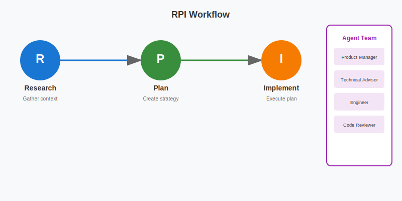

<!-- 翻译标记：development-workflows/rpi/rpi-workflow.md - 已翻译 -->
# RPI Workflow

**RPI** = **R**esearch → **P**lan → **I**mplement

每个阶段都有验证门的系统开发工作流。防止在非可行功能上浪费精力，确保全面的文档。

<table width="100%">
<tr>
<td><a href="../../">← 返回 Claude Code 最佳实践</a></td>
<td align="right"></td>
</tr>
</table>

---

## 概述



---

## 安装

将 `.claude` 文件夹（包含 `agents/` 和 `commands/rpi/`）复制到你的仓库根目录，然后创建 `rpi/plans` 目录。

---

## 示例工作流

### 功能：User Authentication

**Step 1: Describe**
```
User: "Add OAuth2 authentication with Google and GitHub providers"

1. Claude 生成计划
   → 输出：rpi/plans/oauth2-authentication.md
2. 创建功能文件夹：rpi/oauth2-authentication/
3. 将计划复制到功能文件夹
4. 重命名计划为 REQUEST.md
   → 最终：rpi/oauth2-authentication/REQUEST.md
```

**Step 2: Research**
```bash
/rpi:research rpi/oauth2-authentication/REQUEST.md
```
输出：
- `research/RESEARCH.md` 包含分析
- 裁决：**GO**（可行，符合策略）

**Step 3: Plan**
```bash
/rpi:plan oauth2-authentication
```
输出：
- `plan/pm.md` - 用户故事和验收标准
- `plan/ux.md` - 登录 UI 流程
- `plan/eng.md` - 技术架构
- `plan/PLAN.md` - 3 个阶段，15 个任务

**Step 4: Implement**
```bash
/rpi:implement oauth2-authentication
```
进度：
- Phase 1: Backend Foundation → PASS
- Phase 2: Frontend Integration → PASS
- Phase 3: Testing & Polish → PASS

结果：功能完成，准备 PR。

---

## 功能文件夹结构

所有功能工作都在 `rpi/{feature-slug}/` 中：

```
rpi/{feature-slug}/
├── REQUEST.md              # Step 1: 初始功能描述
├── research/
│   └── RESEARCH.md         # Step 2: GO/NO-GO 分析
├── plan/
│   ├── PLAN.md             # Step 3: 实现路线图
│   ├── pm.md               # 产品需求
│   ├── ux.md               # UX 设计
│   └── eng.md              # 技术规格
└── implement/
    └── IMPLEMENT.md        # Step 4: 实现记录
```

---

## Agents 和 Commands

| Command | 使用的 Agents |
|---------|-------------|
| `/rpi:research` | requirement-parser, product-manager, Explore, senior-software-engineer, technical-cto-advisor, documentation-analyst-writer |
| `/rpi:plan` | senior-software-engineer, product-manager, ux-designer, documentation-analyst-writer |
| `/rpi:implement` | Explore, senior-software-engineer, code-reviewer |
