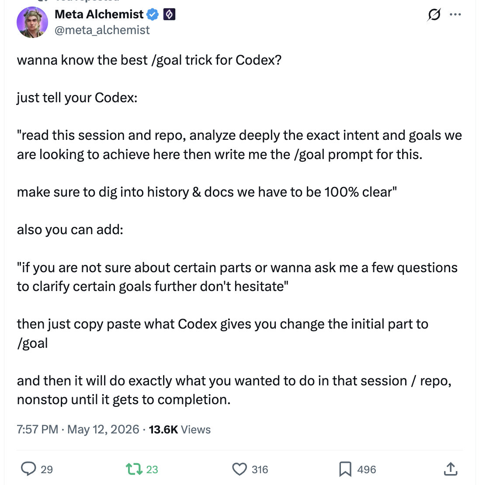

<!-- 
 翻译来源：https://github.com/shanraisshan/claude-code-best-practice/blob/main/implementation/claude-goal-implementation.md
 翻译时间：2026-05-14 02:00 CST
 翻译版本：v0.3.0
-->
# Goal 实现


<table width="100%">
<tr>
<td><a href="../">← 返回 Claude Code 最佳实践</a></td>
<td align="right"></td>
</tr>
</table>

---

<a href="#goal-tips-from-the-community"></a>

`/goal` 让你的 Agent 跨轮次持续工作，直到满足某个条件 —— Claude Code、Codex 和 Hermes Agent 都支持它。社区正在收敛于一些与它配合使用的高价值提示词技巧。

---

## 来自社区的 Goal 技巧

### 1. 让 Agent 自己提出 Goal

<p align="center">
  
</p>

> 官方确认了。Claude Code 刚刚发布了 /goal
>
> 2026 年被严重低估的 AI 功能
>
> 现在 Claude Code、Codex 和 Hermes Agent 都支持了
>
> 它让你的 Agent 能够完成长时间运行的任务，有时可以持续数天
>
> 每个人都应该立即运行这个提示词：
>
> '基于你对我的了解、我的目标、抱负以及我们已经构建的东西，我们能立即运行哪 3 个 /goal，让它们长时间运行并产生最好的结果？'
>
> 选择一个，然后让它为你构建提示词
>
> 你会得到几个超级强大的 goal 提示词选项，让你选择的 Agent 完成长时间运行的任务，带来令人惊叹的结果。
>
> 今晚花 15 分钟来做这件事。以后你会感谢我的。

**来源：** [Alex Finn (@AlexFinn) on X](https://x.com/AlexFinn/status/2053976411296452887)

---

### 2. 让 Agent 帮你写 /goal 提示词

<p align="center">
  
</p>

> 想知道 Codex 最好的 /goal 技巧是什么吗？
>
> 只要告诉你的 Codex：
>
> "阅读这个会话和仓库，深入分析我们想要实现的确切意图和目标，然后为我写出 /goal 提示词。
>
> 确保深入挖掘我们有的历史和文档，做到 100% 清晰"
>
> 你还可以加上：
>
> "如果你对某些部分不确定，或者想问我几个问题来进一步澄清某些目标，不要犹豫"
>
> 然后只需复制粘贴 Codex 给你的内容，把开头部分改成 /goal
>
> 它就会按照你想在这个会话/仓库中做的事情，不停地工作直到完成。

**来源：** [Meta Alchemist (@meta_alchemist) on X](https://x.com/meta_alchemist/status/2054214497443995694)

---

## 

```bash
$ claude
> /goal <condition>
> /goal clear
```

`/goal <condition>` 让 Claude 跨轮次持续工作，直到 Haiku 评估的条件成立。它是对 `/loop`（时间驱动）和 auto mode（逐工具）的补充。需要 Claude Code v2.1.139+。

完整行为请参考[官方文档](https://code.claude.com/docs/en/goal)。
