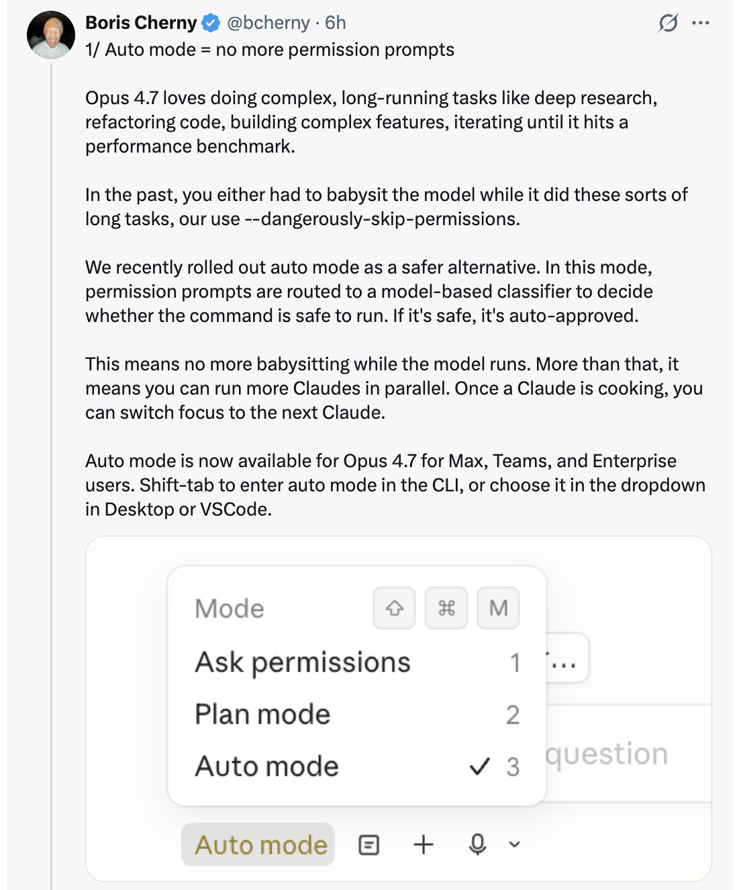

<!-- 翻译来源：https://github.com/shanraisshan/claude-code-best-practice/blob/main/tips/claude-boris-6-tips-16-apr-26.md
翻译时间：2026-04-18
翻译版本：v2.1.112 -->

# 从 Boris Cherny 获取 Opus 4.7 的 6 个使用技巧

Boris Cherny ([@bcherny](https://x.com/bcherny))，Claude Code 的创造者，于 2026 年 4 月 16 日分享的一系列技巧——在狗食测试（dogfooding）Opus 4.7 几周之后。

<table width="100%">
<tr>
<td><a href="../">← 返回 Claude Code 最佳实践</a></td>
<td align="right"></td>
</tr>
</table>

---

## 背景

在狗食测试 Opus 4.7 几周后，Boris 感到"生产力极高"，并分享了六种充分利用新模型的方法——从权限自动化到 effort tuning 再到验证模式。

<a href="https://x.com/bcherny"></a>

---

## 1/ Auto Mode — 不再有权限提示

Opus 4.7 喜欢执行复杂的、长时间运行的任务：深度研究、重构代码、构建复杂功能、迭代直到达到性能基准。过去，你要么得在模型执行这些长任务时 babysit，要么使用 `--dangerously-skip-permissions`。

Anthropic 最近推出了 **Auto Mode** 作为更安全的替代方案。在这种模式下，权限提示会被路由到一个基于模型的分类器，由它决定命令是否可以安全运行：

- 如果是安全的，自动批准
- 如果有风险，暂停并询问

这意味着模型运行时不再需要 babysit。更重要的是，这意味着你可以并行运行更多 Claude —— 如果安全，你可以将注意力切换到下一个 Claude。

Auto Mode 现在对 Max、Teams 和 Enterprise 用户的 Opus 4.7 可用。在 CLI 中使用 **Shift+Tab** 在 `Ask permissions` → `Plan mode` → `Auto mode` 之间循环，或在 Desktop 或 VS Code 中从下拉菜单选择。

<a href="https://x.com/bcherny"></a>

---

## 2/ 新的 /fewer-permission-prompts Skill

Anthropic 发布了一个新的 `/fewer-permission-prompts` skill。它会扫描你的会话历史，找出那些安全但反复触发权限提示的常见 bash 和 MCP 命令。然后它会推荐一个命令列表添加到你的权限 allowlist 中。

使用这个来优化你的权限设置，避免不必要的权限提示，特别是如果你不使用 Auto Mode 的话。

<a href="https://x.com/bcherny"></a>

---

## 3/ Recaps

Anthropic 本周早些时候推出了 **recaps**，为 Opus 4.7 做准备。Recaps 是 agent 做了什么以及接下来做什么的简短摘要。

在离开几分钟或几小时后回到一个长时间运行的会话时非常有用：

```
* Cogitated for 6m 27s

* recap: Fixing the post-submit transcript shift bug. The styling-flash
  part is shipped as PR #29869 (auto-merge on, posted to stamps). Next:
  I need a screen recording of the remaining horizontal rewrap on `cc -c`
  to target that separate cause. (disable recaps in /config)
```

如果你不想要 recaps，可以在 `/config` 中禁用。

<a href="https://x.com/bcherny"></a>

---

## 4/ Focus Mode

Boris 非常喜欢 CLI 中新的 **focus mode**，它隐藏所有中间工作，只关注最终结果。模型已经达到了他通常信任它运行正确命令和进行正确编辑的程度。他只看最终结果。

使用 `/focus` 来切换开启/关闭。

<a href="https://x.com/bcherny"></a>

---

## 5/ 配置你的 Effort Level

Opus 4.7 使用 **adaptive thinking** 而不是 thinking budgets。要调整模型思考的深浅，请调节 effort。

- **Lower effort** — 更快的响应和更低的 token 使用量
- **Higher effort** — 最高的智能和能力

滑块提供五个级别：`low` · `medium` · `high` · `xhigh` · `max` —— 左侧是速度，右侧是智能。

<a href="https://x.com/bcherny"></a>

---

## 6/ 给 Claude 一种验证其工作的方式

最后，确保 Claude 有一种验证其工作的方式。这一直很重要——现在 4.7 的能力是之前的 2-3 倍，所以这一点比以往任何时候都更重要。

验证的方式因任务而异：

- **后端工作** —— 让 Claude 运行你的服务器/服务来进行端到端测试
- **前端工作** —— 使用 [Claude Chromium 扩展](https://code.claude.com/docs/en/chrome) 让 Claude 能够控制你的浏览器
- **桌面应用** —— 使用 Computer Use

Boris 现在的提示看起来像 `Claude do blah blah /go`，其中 `/go` 是一个 skill：

1. 使用 bash、browser 或 computer use 进行端到端自测
2. 运行 `/simplify`
3. 提交一个 PR

对于长时间运行的工作，验证更加重要——当你回到一个任务时，你知道代码是能工作的。

<a href="https://x.com/bcherny"></a>

---

## 来源

- [Boris Cherny (@bcherny) on X — 2026 年 4 月 16 日](https://x.com/bcherny)
